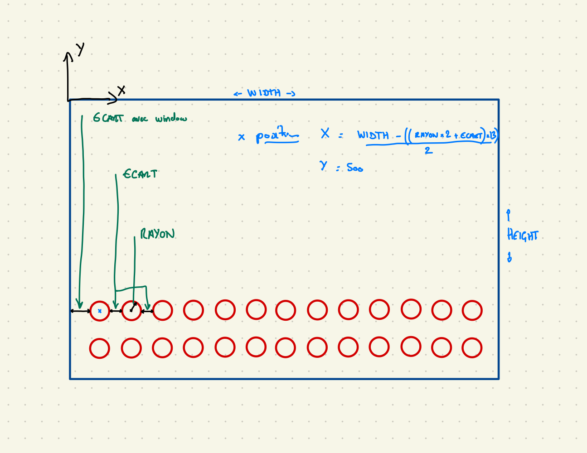

# Deroulement de l'atelier

### 1 - Mise en place de la fenetre pygame

```python
import pygame

# initiatlisation de pygame
pygame.init()

# mise en place et affichage de la fenetre de jeu

# constante pour la dimension de la fenetre
WIDTH = 800 # largeur
HEIGHT = 600 # hauteur

window = pygame.display.set_mode((WIDTH, HEIGHT))  # instruction pygame.display.set_mode((x,y)) pour la définition de la fenetre => dans une variable
pygame.display.set_caption("Nom de la fenetre") # ajout d'un nom à la fenetre
icon = pygame.image.load('gaming.png') #affectation d'une image dans une variable
pygame.display.set_icon(icon) # mise en place de l'image sur la fenetre

```

### 2 - Mise en place de la boucle d'affichage de la fenetre 

```python
# Boucle de jeu
run = True # variable boolean precisant que le jeu tourne
while run:
    for event in pygame.event.get(): # boucle for pour capturer les evenements de la fenetre
        if event.type == pygame.QUIT:
            run = False
```

### 3 - Mise en place d'une fonction d'affichage
```python
# mise en place d'une fonction d'affichage

def draw():
    window.fill((255,255,255))
    pygame.display.update()

```

ajout de l'appel de la fonction dans la boucle de jeu.
definition d'une section de couleur pour enregister les couleur sous forme de variable.

explication des positions x,y avec le captage du clic de la souris
```python
        if event.type == pygame.MOUSEBUTTONDOWN:
            pos = pygame.mouse.get_pos()
            print(pos)
```

### 4 - chargment et affichage des images de la potence pendu

```python
# chargement des images potence
images = [] # on créer un liste des images
# alimentation de la list avec les images de pendu
for i in range(7):
    image = pygame.image.load("images/pendu" + str(i) + ".png")
    images.append(image)
```

ajouter une section pour les variables du jeu

```python
# variables du jeu
penduStatut = 2

# dans la fonction draw ajouter:
window.blit(images[penduStatut], (150,100))

```


### 5 - affichage des 26 lettres de l'alphabet dans des cercles
on commence par faire des maths


nous ajoutons les coordonnées des lettres dans une liste

```python
# ajout des lettres de l'alphabet
RAYON = 20
ECART = 15
letters = [] # liste pour les lettres
startX = round( (WIDTH - (RAYON * 2 + ECART) * 13) / 2 )  # formule math pour position X sur la fenetre
startY = 500

for i in range(26): # pour les 26 lettre de l'alphabet
    x = startX + ECART * 2 + ((RAYON * 2 + ECART) * i%13) # pour la gestion de la ligne 2
    y = startY + ((i//13) * (ECART + RAYON * 2))
    letters.append([x, y])

```

on ajoute alors le dessin des ronds dans la fonction draw()
```python
    # dession des lettres
    for lettre in lettres:
        x, y = lettre #decompose
        pygame.draw.circle(window, BLACK, (x,y), RAYON, 3) # pour les ronds - fenetre, couleur, coordonnées, rayon, epaisseur du trait
```

on ajoute les lettres  / definiion des fonts  et de chr()
```python
# Police de caratère
LETTER_FONT = pygame.font.SysFont('comicsans', 40)
```

ajout de A = 65 et chr(A + i) dans l'initialisaiton de la liste lettres.

ajout dans la focntion draw()
```python
    # dession des lettres
    for lettre in lettres:
        x, y, ltr = lettre #decompose
        pygame.draw.circle(window, BLACK, (x,y), RAYON, 3) # pour les ronds - fenetre, couleur, coordonnées, rayon, epaisseur du trait
        # utilisation de la fonction render
        text = LETTER_FONT.render(ltr, 1, BLACK)
        window.blit(text, (x - text.get_width()/2, y - text.get_height()/2))
```


### 6 - quand on clic sur une lettre alors nous savons quelles est sa valeur - si cliqué alors on fait disparaitre.

un peu de math à nouveau

dans la boucle de jeu on recupere les coordonnée du clic de souris dans des variables
et l'on compare à l'emplacement des lettres, mes coordonnées sont dans le cercle ? en gros 
on utilise ici une distance et le theoreme de Pythagore **vive les math**
je ne fait pas la demo ici, manque de temps, mais pour les matheux .... H² = A² + O²

```python
        if event.type == pygame.MOUSEBUTTONDOWN:
            m_x, m_y = pygame.mouse.get_pos()
            for lettre in lettres:
                x, y, ltr = lettre # decompose
                dis = math.sqrt((x - m_x)**2 + (y - m_y)**2) # pythagore
                if dis < RAYON:
                    print(ltr) # à commenter par la suite
```

si cliqué alors on efface la lettre ?
ajout d'une information complémentaire dans la liste des lettres un boolean visible True or False
modificaiton de draw() et de la boucle du jeu.

##### Draw()
```python
    # dession des lettres
    for lettre in lettres:
        x, y, ltr, visible = lettre #decompose
        if visible:
            pygame.draw.circle(window, BLACK, (x,y), RAYON, 3) # pour les ronds - fenetre, couleur, coordonnées, rayon, epaisseur du trait
            # utilisation de la fonction render
            text = LETTER_FONT.render(ltr, 1, BLACK)
            window.blit(text, (x - text.get_width()/2, y - text.get_height()/2))
```

##### Boucle de jeu
```python
            for lettre in lettres:
                x, y, ltr, visible = lettre # decompose
                if visible:
                    dis = math.sqrt((x - m_x)**2 + (y - m_y)**2) # pythagore
                    if dis < RAYON:
                        lettre[3] = False
```


# Etape du plateau de jeu fini
Déja bien si arrivé ici.

*reste alors la logique du jeu de pendu a implémenter*
*et l'affichage du mot*

### 7 - Choix d'un mot et affichage de celui-ci à l'écran

deplacment de la fonction draw dans la boucle de jeu en fin de prgm.

ajout dans les variable du jeu du mot
et d'une liste pour les lettres devinées:
```python
mot = "CODING"
lettreDevinee = []
```

dans la fonciton draw() on ajoute:
```python
    # dessin du mot
    afficheMot = ""
    for lettre in mot:
        if lettre in lettreDevinee:
            afficheMot += lettre + " "
        else:
            afficheMot += "_ "
    text = MOT_FONT.render(afficheMot, 1, BLACK)
    window.blit(text, (400, 200))
```

### 8 - test si la lettre est dans le mot lors du choix d'une lettre et eveolution pendu

on position la variable penduStatut = 0

dans la boucle du jeu, pour un clic sur une lettre on l'ajoute à lettreDevinee
si la lettre n'est dans le mot alors on incremente la variable dependuStatut de 1

```python
                    if dis < RAYON:
                        lettre[3] = False
                        lettreDevinee.append(ltr)
                        if ltr not in mot:
                            penduStatut += 1
```

### 9 - affichage gagné / perdu - fin du jeu

nous allons ajouter une fonction pour afficher un message au centre de l'écran


```python
def afficheMessage(message):
    pygame.time.delay(3000)
    win.fill(BLACK)
    text = TITRE_FONT.render(message, 1, WHITE)
    win.blit(text, (WIDTH/2 - text.get_width()/2, HEIGHT/2 - text.get_height()/2))
    pygame.display.update()
    pygame.time.delay(3000)
```

et ensuite dans la bloucle de jeu afficher le message selon les cas:

```python
    gagne = True
    for lettre in mot:
        if lettre not in lettreDevinee:
            gagne = False
            break

    if gagne:
        afficheMessage("Gagné !")
        break

    if penduStatut == 6:
        afficheMessage("Perdu !")
        break
```

on termine ici, prochaine etape possible, listes mot et choix aléatoire dans la liste, 
bouton rejouer, ...

Merci.